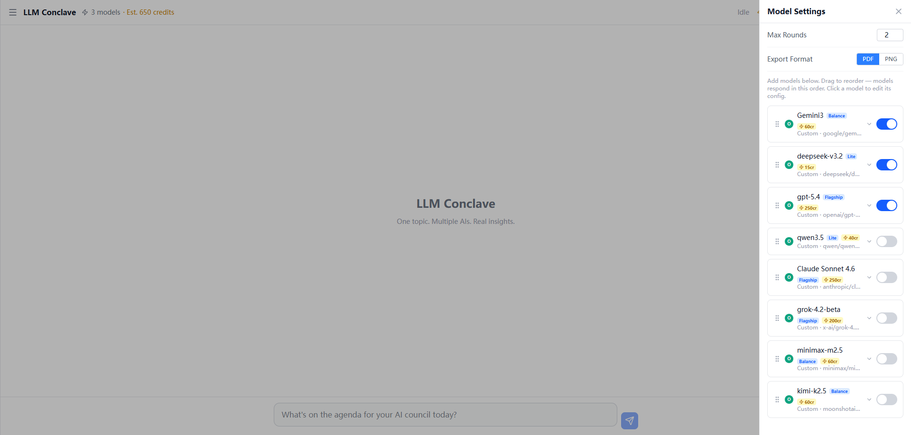

# LLM Conclave

**Multi-model AI debate platform** — put multiple LLMs in a structured discussion, then receive an auto-generated research report.

> **Self-hosted · No account required · Bring your own API keys**



---

## Features

- **Multi-model debate** — models respond in sequence, each reading the others' arguments
- **Configurable rounds** — 1–10 rounds per session
- **Auto-generated report** — AI-written meeting minutes exported as PDF or PNG
- **BYOK** — use your own OpenAI / Anthropic / Gemini / DeepSeek / Groq / OpenRouter key
- **i18n** — English · 中文 · 日本語
- **Session history** — stored locally in the browser (IndexedDB), no server DB required
- **Mobile-friendly** — responsive layout, iOS share sheet for export

---

## Quick Start

### Docker (recommended)

```bash
git clone https://github.com/DreamArc77/LLM-Conclave.git
cd LLM-Conclave
docker compose up -d
```

Open **http://localhost:3000**, then go to **Settings** → **Add Model** → enter your API key.

### npm (local development)

```bash
git clone https://github.com/DreamArc77/LLM-Conclave.git
cd LLM-Conclave
npm install
cp .env.local.example .env.local
npm run dev
```

Open **http://localhost:3000**.

---

## How to Add a Model

1. Click the **⚙ Settings** button (top-right)
2. Click **Add Model**
3. Choose a provider (OpenAI, Anthropic, Google, DeepSeek, Groq, OpenRouter, …)
4. Enter your **API Key** and optionally the **Model ID** and **Display Name**
5. Toggle the model **on** and click **Send** to start a debate

You can add as many models as you like. The debate runs them in order, each seeing the full prior context.

---

## Supported Providers

| Provider | Protocol | Notes |
|----------|----------|-------|
| OpenAI | openai-compatible | GPT-4o, GPT-4.1, o1, … |
| Anthropic | anthropic | Claude 3.5 / 4 Sonnet, Opus, … |
| Google | google-gemini | Gemini 2.0 / 2.5 Flash / Pro |
| DeepSeek | openai-compatible | deepseek-chat, deepseek-reasoner |
| Groq | openai-compatible | llama-3.3-70b, gemma-2-27b, … |
| OpenRouter | openai-compatible | 200+ models via one key |
| Custom | openai-compatible | Any OpenAI-compatible endpoint |

---

## Export (PDF / PNG)

After a debate completes, the app generates meeting minutes automatically. You can export them as:

- **PNG** — client-side rendering (works everywhere, no server config needed)
- **PDF** — uses Chromium on the server

PDF export requires Chromium. It is pre-installed in the Docker image. For local development, set the path in `.env.local`:

```
CHROMIUM_PATH=/Applications/Google Chrome.app/Contents/MacOS/Google Chrome
```

---

## Environment Variables

Copy `.env.local.example` to `.env.local`. All variables are optional.

| Variable | Default | Description |
|----------|---------|-------------|
| `CHROMIUM_PATH` | `/usr/bin/chromium-browser` | Path to Chromium for PDF export |
| `REDIS_DISABLED` | `true` | Use in-memory job store (single instance) |

---

## Tech Stack

- **Next.js 16** (App Router, standalone output)
- **React 19** + **Tailwind CSS** + **Zustand**
- **Provider SDKs**: `openai`, `@anthropic-ai/sdk`, `@google/genai`
- **Storage**: IndexedDB (Dexie) — no backend database
- **Export**: html2canvas + jsPDF (client PNG), Puppeteer-core (server PDF)

---

## License

MIT

---

---

# LLM Conclave（中文说明）

**多模型 AI 辩论平台** — 让多个大语言模型就同一议题展开多轮讨论，自动生成研究报告。

> **本地自托管 · 无需账号 · 使用自己的 API Key**

---

## 功能特点

- **多模型辩论** — 多个模型依次发言，每个模型都能看到其他模型的观点
- **可配置轮次** — 每次会话支持 1–10 轮
- **自动生成报告** — AI 撰写会议纪要，可导出为 PDF 或 PNG
- **自带 API Key** — 支持 OpenAI / Anthropic / Gemini / DeepSeek / Groq / OpenRouter
- **多语言** — 英文 · 中文 · 日文
- **会话历史** — 数据保存在浏览器本地（IndexedDB），无需服务端数据库
- **移动端适配** — 响应式布局，iOS 支持系统分享导出

---

## 快速开始

### Docker（推荐）

```bash
git clone https://github.com/DreamArc77/LLM-Conclave.git
cd LLM-Conclave
docker compose up -d
```

浏览器访问 **http://localhost:3000**，然后点击右上角 **⚙ 设置** → **添加模型** → 填入 API Key。

### npm（本地开发）

```bash
git clone https://github.com/DreamArc77/LLM-Conclave.git
cd LLM-Conclave
npm install
cp .env.local.example .env.local
npm run dev
```

浏览器访问 **http://localhost:3000**。

---

## 如何添加模型

1. 点击右上角 **⚙ 设置**
2. 点击 **添加模型**
3. 选择服务商（OpenAI、Anthropic、Google、DeepSeek、Groq、OpenRouter……）
4. 填入 **API Key**，可选填写 **模型 ID** 和 **显示名称**
5. 打开模型开关，点击发送即可开始辩论

可以添加任意数量的模型，辩论时按顺序轮流发言，每个模型都能看到完整的对话上下文。

---

## 支持的服务商

| 服务商 | 协议 | 说明 |
|--------|------|------|
| OpenAI | openai-compatible | GPT-4o、GPT-4.1、o1 等 |
| Anthropic | anthropic | Claude 3.5 / 4 系列 |
| Google | google-gemini | Gemini 2.0 / 2.5 Flash / Pro |
| DeepSeek | openai-compatible | deepseek-chat、deepseek-reasoner |
| Groq | openai-compatible | llama-3.3-70b、gemma-2-27b 等 |
| OpenRouter | openai-compatible | 一个 Key 访问 200+ 模型 |
| 自定义 | openai-compatible | 任意 OpenAI 兼容接口 |

---

## 导出功能（PDF / PNG）

辩论结束后自动生成会议纪要，可导出为：

- **PNG** — 客户端渲染，无需服务端配置，随处可用
- **PDF** — 使用服务端 Chromium 渲染

Docker 镜像已预装 Chromium，无需额外配置。本地开发时，在 `.env.local` 中设置路径：

```
# macOS
CHROMIUM_PATH=/Applications/Google Chrome.app/Contents/MacOS/Google Chrome

# Linux
CHROMIUM_PATH=/usr/bin/chromium-browser
```

---

## 环境变量

将 `.env.local.example` 复制为 `.env.local`，所有变量均为可选。

| 变量 | 默认值 | 说明 |
|------|--------|------|
| `CHROMIUM_PATH` | `/usr/bin/chromium-browser` | Chromium 路径，用于 PDF 导出 |
| `REDIS_DISABLED` | `true` | 使用内存 Job Store（单实例部署） |

---

## 技术栈

- **Next.js 16**（App Router，standalone 输出）
- **React 19** + **Tailwind CSS** + **Zustand**
- **Provider SDK**：`openai`、`@anthropic-ai/sdk`、`@google/genai`
- **本地存储**：IndexedDB（Dexie）— 无需后端数据库
- **导出**：html2canvas + jsPDF（客户端 PNG）、Puppeteer-core（服务端 PDF）

---

## 开源协议

MIT
